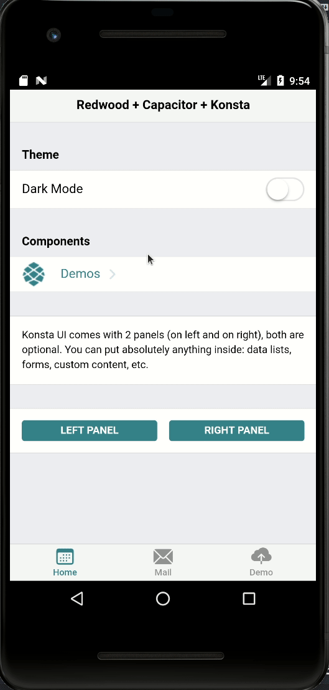

<h1 align="center">Welcome to redwood-capacitor-konsta-demo 👋</h1>

<p  align="center">
  <a href="#" target="_blank">
    
  </a>
  <a href="https://twitter.com/pi0neerpat" target="_blank">
    
  </a>
</p>

> Turn RedwoodJS apps into native mobile apps for Android and iOS

<p align="center">

</p>

NOTE: :warning: This demo is still under development. Contributions welcome!

### Resources

- Konsta UI https://konstaui.com/
- Capacitor https://capacitorjs.com/
- Framework7 (not implemented here but relevant) https://framework7.io/

# Setup

You'll need Android Studio and Java install. Additionally, you'll need to install an Android device to emulate.

## Installation

- Android Studio: https://developer.android.com/studio Install in `/usr/local/`
- Java: download at https://www.oracle.com/java/technologies/downloads/ and install https://docs.oracle.com/en/java/javase/18/install/installation-jdk-linux-platforms.html#GUID-ADC9C14A-5F51-4C32-802C-9639A947317F
- Create a new device in Android Studio. API version must be 24 or greater to work with Capacitor.
- Setup the Android Studio environment https://capacitorjs.com/docs/getting-started/environment-setup#android-development. NOTE: API should not be higher than v31. I had to remove the tools installed by default for API v32, and only use Android 12 (s). See https://github.com/ionic-team/native-run/issues/219#issuecomment-1016503975

## Redwood setup

Follow these steps to add Capacitor to an existing redwood project

1.  Add capacitor to your redwood app in `web` using the instructions here https://github.com/ionic-team/capacitor

2.  You MUST perform setup within `/web` directory, since capacitor does not work well with monorepos. If you correctl installed things in `web/package.json`, then later you should see "Found x Capacitor plugins...":


# Usage

## Run emulator

Update `.env` with the location of your Android sdk. Also, you must ensure web uses the correct api url

```
ANDROID_HOME=/path/to/Android/Sdk
ANDROID_SDK_ROOT=/home/dev/Android/Sdk
REDWOOD_API_URL=http://10.0.2.2:8911
```

> Update ~/.bashrc with `export ANDROID_HOME=/home/dev/Android/Sdk` and restart the terminal to avoid having to set the environment each time.

Next build web and run.

```
./web.sh

npx cap run android
```

Logs can be views in chrome at `chrome://inspect#devices`

## Hot-reload

Enable hot-reload by modifying `capacitor.config.ts` to uncomment the `server` property.

# Development

### Deep links

1. Add intents to `AndroidManifest.xml` and handle incoming intents in the app in
   - use Android Studio "App Links Assistant" https://developer.android.com/studio/write/app-link-indexing
2. ??? in `MainActivity.java`
3. Verify app links (so they open automatically) https://developer.android.com/training/app-links/verify-site-associations and https://devdactic.com/universal-links-ionic/

Test using intents (see https://developer.android.com/training/app-links/deep-linking)

```
adb shell am start -W -a android.intent.action.VIEW -d "http://0.0.0.0:8910/redirect" com.treasurechess.app
```

### Security

https://capacitorjs.com/docs/guides/security#data-security

# NOTES

- Hot re-load is hit-or-miss for working. Not sure why
- isBrowser from `@redwoodjs/prerender/browserUtils` returns false for Android
